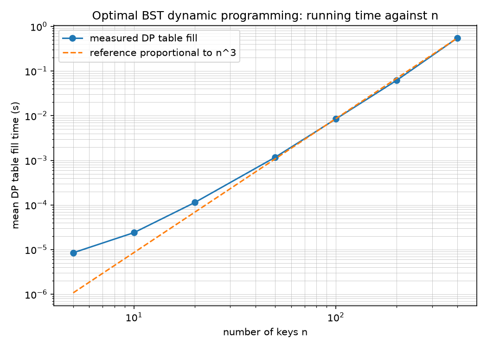

# Optimal Binary Search Tree

A dynamic programming implementation that builds the binary search tree
minimizing expected search cost, given sorted keys and their access
probabilities.

## Problem

A binary search tree can be arranged in many ways over the same set of keys.
When some keys are searched more often than others, the arrangement changes how
many comparisons an average search needs.

For keys `k₁ … kₙ` with access probabilities `p₁ … pₙ`, the expected search cost
is

```
E = Σ pᵢ × depth(kᵢ)          (root at depth 1)
```

The probabilities are fixed by the input, so the depths are the only thing under
our control. The task is to find the tree shape that minimizes `E`.

Exhaustive search is not viable: the number of distinct BSTs on `n` keys is the
Catalan number `Cₙ`, which is 42 for `n = 5` and roughly 6.56 billion for
`n = 20`. Dynamic programming solves `n = 20` in 1,540 inner operations.

## Algorithm

**State.** `C[i][j]` is the minimum expected cost of an optimal BST over keys
`kᵢ … kⱼ`, with depth measured relative to that subtree's own root.

**Recurrence.**

```
C[i][j] = min over r in [i..j] of { C[i][r-1] + C[r+1][j] } + W(i, j)

W(i, j) = pᵢ + … + pⱼ
```

**Base case.** `C[i][j] = 0` when `i > j`. The single-key case `C[i][i] = pᵢ`
follows from it.

The `W(i, j)` term appears because choosing `r` as root pushes every key in the
interval one level deeper relative to its position within its own subtree, so
each contributes one extra comparison weighted by its probability.

`W(i, j)` is evaluated in O(1) from a precomputed prefix-sum array. Computing it
inside the innermost loop would make the algorithm O(n⁴).

**Complexity.** Time O(n³), space O(n²). There are Θ(n²) subproblems and each
tries up to O(n) roots; the exact inner-loop count is `n(n+1)(n+2)/6`.

## Results

On the five-key example — keys 10 to 50 with probabilities 0.10, 0.20, 0.40,
0.20, 0.10 — the optimal tree costs **1.80** expected comparisons:

```
        30
       /  \
     20    40
    /        \
  10          50
```

Compared against two conventional trees built from the same keys:

| Tree | Expected cost | Average depth | Height |
|---|---|---|---|
| Sequential insertion (sorted order) | 3.00 | 3.00 | 5 |
| Balanced (recursive midpoint) | 1.90 | 2.20 | 3 |
| **Optimal (this implementation)** | **1.80** | 2.20 | 3 |

The balanced tree and the optimal tree have the same height and the same
average depth — their depth multisets are both {1, 2, 2, 3, 3}. The entire
improvement comes from *which* key occupies each depth. A balanced tree cannot
see the probabilities, so it places key 10 (p = 0.10) above key 20 (p = 0.20);
the DP swaps them.

### Measured running time

Mean over 5 random instances per size, timing the DP table fill alone:

| n | Mean time (s) | Inner loop count | µs per operation |
|---:|---:|---:|---:|
| 5 | 0.000008 | 35 | 0.243 |
| 10 | 0.000024 | 220 | 0.109 |
| 20 | 0.000113 | 1,540 | 0.074 |
| 50 | 0.001168 | 22,100 | 0.053 |
| 100 | 0.008437 | 171,700 | 0.049 |
| 200 | 0.061855 | 1,353,400 | 0.046 |
| 400 | 0.550207 | 10,746,800 | 0.051 |

The cost per inner-loop operation converges to roughly 0.05 µs, which is what
O(n³) predicts: total time is the operation count times a constant. Doubling n
from 200 to 400 multiplied the time by 8.9, against the 8.0 a cubic predicts.

A least-squares fit of log(time) against log(n) gives an exponent of **2.57**
across all sizes and **2.84** across n ≥ 20. The two differ because at n = 5 the
DP performs only 35 operations while fixed interpreter overhead costs a
comparable amount; that overhead is roughly constant in n, so it inflates the
smallest measurements and flattens the fit. The estimate rises toward 3 as the
smallest sizes are dropped.



## Requirements

Python 3.10 or newer. The core program uses only the standard library.

`matplotlib` is needed only to render the complexity plot, and `pytest` only to
run the test suite:

```bash
pip install -r requirements.txt
```

## Usage

Run the assignment's example with no arguments:

```bash
python main.py
```

Read a problem from a file, and compare against conventional trees:

```bash
python main.py --file data/example5.txt --compare
```

All options:

| Option | Effect |
|---|---|
| `--file PATH` | Read the problem from a file |
| `--interactive` | Prompt for keys and probabilities on stdin |
| `--random N` | Generate N keys with random probabilities |
| `--seed S` | Seed for `--random` (default 42) |
| `--compare` | Also build and compare the conventional trees |
| `--no-tables` | Suppress the cost and root tables |

The DP tables are suppressed automatically above n = 15, where they no longer
fit a terminal.

Reproduce the timing experiments:

```bash
python experiments.py
```

This writes `results/timings.csv` and `results/complexity.png`. The default run
takes about 30 seconds, most of it at n = 400.

## Input format

A plain text file. Blank lines are ignored, and so is any line whose first
non-space character is `#`. The first remaining line is the number of keys;
each following line holds a key and its probability, separated by whitespace.

```
# Assignment example: five keys, expected optimal cost 1.80
5
10 0.10
20 0.20
30 0.40
40 0.20
50 0.10
```

Keys must be integers in strictly increasing order. Probabilities must be
non-negative and sum to 1 within a tolerance of 1e-6. Invalid input produces a
single error message naming the fault and exits with status 1:

```
$ python main.py --file data/invalid_sum.txt
Error: probabilities must sum to 1, they sum to 0.9 (tolerance 1e-06)
```

The `data/` directory holds three valid examples and four deliberately broken
ones covering each validation path.

## Testing

```bash
pytest tests/
```

185 tests covering: the hand-computed cost and root tables for the three- and
five-key cases, cell by cell; edge cases including a single key and a key
carrying all the probability; prefix-sum correctness; validation and parsing
errors; and the properties of the conventional baselines.

Two groups are worth singling out. The property tests re-derive the expected
cost by walking the reconstructed tree and check it against C[1][n] for random
instances up to n = 30, confirming that the tree and the table agree without
either being told the answer. The brute-force tests enumerate every binary
search tree over n ≤ 7 keys — 429 distinct shapes at n = 7 — and confirm the DP
finds the same minimum.

## Project structure

```
main.py              CLI entry point
experiments.py       timing harness and complexity plot
src/obst.py          DP cost and root tables
src/tree.py          tree reconstruction, depths, cost verification
src/baseline.py      conventional BSTs for comparison
src/validation.py    input parsing and validation
tests/               pytest suite
data/                sample and invalid inputs
results/             timing data and plots
docs/                project report
```

## License

MIT. See [LICENSE](LICENSE).